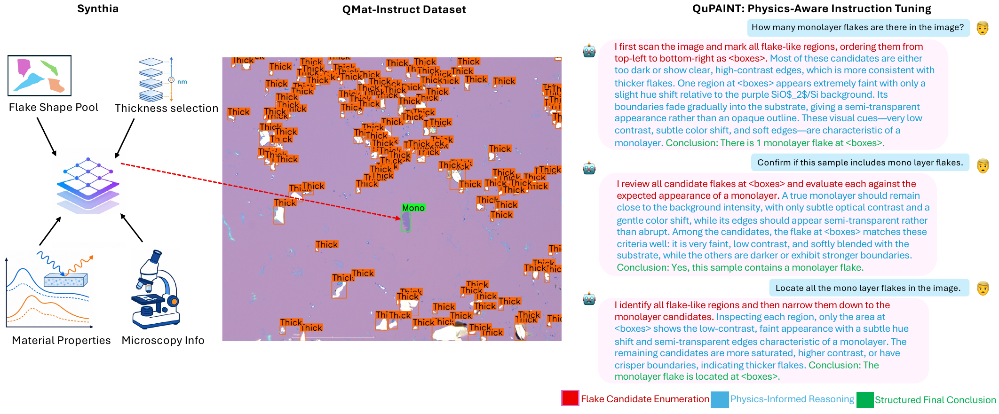
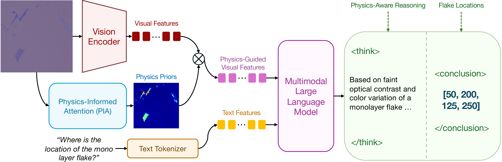
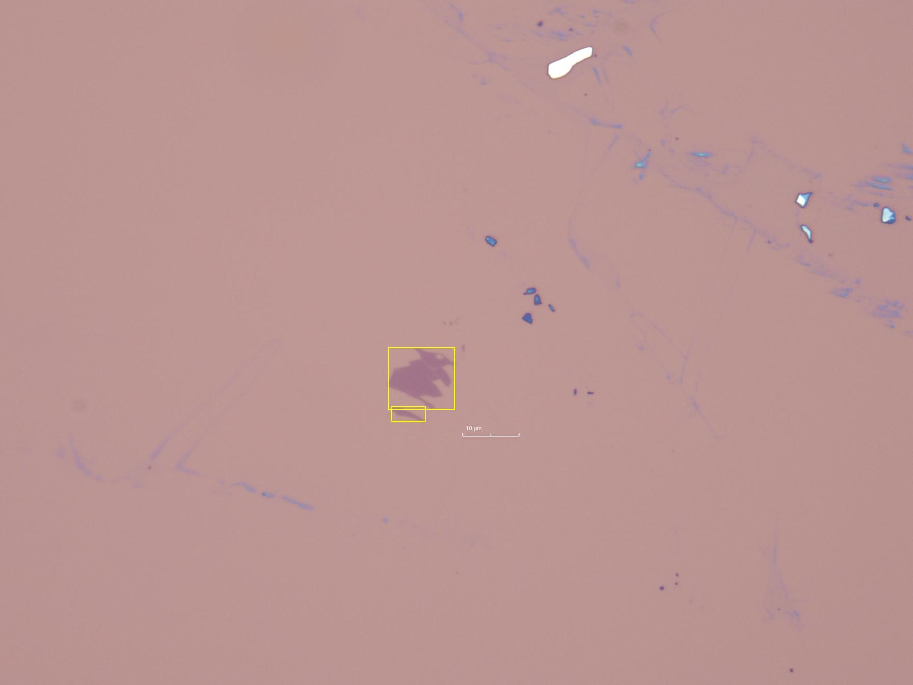

<div align="center">

# QuPAINT: Physics-Aware Instruction Tuning Approach to Quantum Material Discovery

**IEEE/CVF Conference on Computer Vision and Pattern Recognition (CVPR) 2026 — Findings Track**

[Xuan Bac Nguyen](https://ngxbac.github.io/)<sup>1</sup> ·
[Hoang-Quan Nguyen](https://nhquanqt.github.io/)<sup>1</sup> ·
[Sankalp Pandey](https://www.sankalppandey.tech/)<sup>1</sup> ·
[Tim Faltermeier](https://www.boryslab.com/people-1)<sup>2</sup> ·
[Nicholas Borys](https://www.boryslab.com/people-1)<sup>2</sup> ·
[Hugh Churchill](https://physics.uark.edu/directory/index/uid/hchurch/name/Hugh+Churchill/)<sup>3</sup> ·
[Khoa Luu](https://engineering.uark.edu/electrical-engineering-computer-science/electrical-engineering-faculty/uid/khoaluu/name/Khoa+Luu/)<sup>1</sup>

<sup>1</sup> CVIU Lab, University of Arkansas &nbsp;·&nbsp;
<sup>2</sup> University of Utah &nbsp;·&nbsp;
<sup>3</sup> Department of Physics, University of Arkansas

[](https://uark-cviu.github.io/projects/qupaint/)
[](https://openaccess.thecvf.com/content/CVPR2026F/papers/Nguyen_QuPAINT_Physics-Aware_Instruction_Tuning_Approach_to_Quantum_Material_Discovery_CVPRF_2026_paper.pdf)
[](https://huggingface.co/uark-cviu/QuPAINT-4B)
[](https://arxiv.org/abs/2602.17478)
[](https://uark-my.sharepoint.com/:f:/g/personal/sankalpp_uark_edu/IgDiKftTT9A4QbiZJgZy--GZAYOqZmG4MGUe126NJJ44uao?e=G1iQcS)
[](LICENSE)



</div>

---

This repository provides **inference code and pretrained weights** for QuPAINT, a
physics-aware multimodal model for analyzing two-dimensional (2D) quantum material
flakes in optical micrographs. Give it a micrograph and a question; it returns a
written analysis and bounding boxes for the flakes it commits to.

> **Note.** This release covers inference only. Training code, the Synthia data
> generator, and the QMat-Instruct construction pipeline are part of the journal
> extension currently under review and will be released separately.

## Abstract

Reliable identification of two-dimensional (2D) quantum materials from optical microscopy
is challenging due to domain shifts between synthetic training data and real laboratory
images. The observed appearance of a flake depends not only on its material and thickness,
but also on substrate properties, illumination, camera response, focus, noise, and other
acquisition-specific factors. In this domain, artificial intelligence (AI) models are
typically trained on limited, in-house datasets and may perform well under familiar
conditions but degrade substantially when transferred across laboratories or imaging
systems. To address this, we present a physics-aware multimodal framework for learning
transferable representations of quantum material flakes. We first introduce a data
generation approach, **Synthia**, that expands the physical and visual diversity of
synthetic microscopy images while preserving layer-dependent optical behavior. Using the
synthesized data, we construct **QMat-Instruct**, a physics-informed multimodal instruction
dataset with structured reasoning traces that relate visual observations to material
properties, substrate conditions, and layer-dependent optical responses. These reasoning
traces teach Multimodal Large Language Models to interpret flake appearance and thickness.
To generate this supervision, we employ annotation-conditioned visual rationalization,
where a strong Vision-Language Model explains verified flake annotations using only
observable optical cues. We then introduce **Physics-Aware Instruction Tuning (QuPAINT)**,
a multimodal architecture that uses a **Physics-Informed Attention** approach to fuse visual
embeddings with optical priors, enabling more robust and discriminative flake representations.

## Method

<div align="center">

</div>

**Physics-Informed Attention (PIA)** approximates the optical thin-film contrast of 2D
materials with a physics-aware proxy: the perceptual color contrast (ΔE) in CIELAB space
between a flake region and its surrounding substrate. This gives an illumination-invariant
measure of the reflectance differences caused by thin-film interference, producing an
attention map that highlights physically meaningful optical cues without a full optical
simulation. Those priors are fused with the visual embeddings, and the model is instruction-
tuned on QMat-Instruct so it reasons about flake appearance from observable optical evidence
alone. See the [paper](https://openaccess.thecvf.com/content/CVPR2026F/papers/Nguyen_QuPAINT_Physics-Aware_Instruction_Tuning_Approach_to_Quantum_Material_Discovery_CVPRF_2026_paper.pdf)
for the full formulation.

## Installation

Requires Python 3.10+ and a CUDA GPU with ~12 GB of free memory for the 4B model.

```bash
git clone https://github.com/uark-cviu/QuPAINT.git
cd QuPAINT

conda create -n qupaint python=3.10 -y && conda activate qupaint
pip install torch --index-url https://download.pytorch.org/whl/cu121   # match your CUDA
pip install -r requirements.txt
```

FlashAttention is optional. Without it the vision encoder falls back to standard
attention, which is slower but numerically equivalent; pass `--flash_attn` only if
you installed `flash-attn`.

## Quick start

### Command line

```bash
python inference.py \
    --checkpoint uark-cviu/QuPAINT-4B \
    --image examples/sample-01.jpg \
    --prompt "Identify monolayer candidates and provide bounding boxes [x,y,w,h]" \
    --save_dir ./outputs
```

Weights download from the Hub on first use. Point `--checkpoint` at a local directory
to use your own copy, and `--image` at a folder to process it in batch. Each run writes
an annotated image plus a JSON file with the raw response and pixel boxes.

### Interactive demo

```bash
python demo.py --checkpoint uark-cviu/QuPAINT-4B
```

Opens a Gradio app on `http://127.0.0.1:7860` where you can upload a micrograph, edit
the prompt, and see the boxes drawn on the image. Add `--share` for a temporary public link.

### Python API

```python
import torch
from transformers import AutoTokenizer
from qupaint import QuPAINTModel, load_image, parse_boxes, draw_boxes

ckpt = "uark-cviu/QuPAINT-4B"
model = QuPAINTModel.from_pretrained(
    ckpt, dtype=torch.bfloat16, low_cpu_mem_usage=True, use_flash_attn=False
).eval().cuda()
tokenizer = AutoTokenizer.from_pretrained(ckpt, trust_remote_code=True)

pixel_values = load_image("examples/sample-01.jpg").to(torch.bfloat16).cuda()
response = model.chat(
    tokenizer,
    pixel_values,
    "<image>\nIdentify all flakes and provide bounding boxes [x,y,w,h] for each.",
    dict(max_new_tokens=4096, do_sample=False),
)
print(response)
print(parse_boxes(response, height=1344, width=1792))   # pixel boxes on the 1792x1344 canvas
```

The weights also load through `transformers` directly:

```python
from transformers import AutoModel
model = AutoModel.from_pretrained(ckpt, trust_remote_code=True, dtype=torch.bfloat16)
```

## Prompts and output format

QuPAINT is instruction-tuned for flake analysis. Prompts that match its training
distribution work best:

| Goal | Prompt |
|---|---|
| Detect everything | `Identify all flakes and provide bounding boxes [x,y,w,h] for each` |
| Monolayer candidates | `Identify monolayer candidates and provide bounding boxes [x,y,w,h]` |
| Counting | `How many material flakes are there in the image?` |
| Optical reasoning | `Describe the optical contrast of the flakes relative to the substrate` |

A response enumerates the flakes it sees, explains the optical evidence, and closes with
a `<CONCLUSION>` span holding the flakes it commits to:

```
All flakes are collected first as <box>59.76, 6.88, 4.74, 4.44</box> <box>42.52, 50.68, 7.39, 9.08</box> ...
Monolayer flakes show lighter contrast and subtle color shift relative to the substrate.
<CONCLUSION>
The monolayer candidates are at: <box>42.52, 50.68, 7.39, 9.08</box>
</CONCLUSION>
```

<div align="center">

<br><em><code>examples/sample-01.jpg</code> — the two boxes QuPAINT committed to as monolayer candidates.</em>
</div>

Boxes are `x, y, width, height` in **percent** of image width and height, top-left origin.
`qupaint.postprocess` converts them: `parse_conclusion_boxes` returns the percent boxes,
`parse_boxes` converts straight to pixels, and `draw_boxes` renders them.

Two details worth knowing:

- **Input canvas.** Images are resized to a fixed 1792x1344 canvas and tiled into 448px
  patches before encoding, matching the tuning resolution. Because boxes are in percent,
  they map back onto your original image regardless of its size. Lower `--max_tiles` to
  trade accuracy for speed.
- **Decoding.** The CLI and demo default to greedy decoding so the same micrograph gives
  the same boxes. Pass `--do_sample` to sample instead.

## Models

| Model | Params | Link |
|---|---|---|
| QuPAINT-4B | 4B | [uark-cviu/QuPAINT-4B](https://huggingface.co/uark-cviu/QuPAINT-4B) |

The architecture pairs a vision transformer encoder with a 4B-parameter language model
through an MLP projector, instruction-tuned on QMat-Instruct.

## Data and benchmark

**QF-Bench** is our evaluation benchmark for quantum material characterization: eight 2D
materials imaged under a range of microscopy and substrate conditions, with bounding-box
and layer annotations for mono-layer (1L), few-layer (2–4L), and thick (5+L) flakes.

| Material  |   Mono    |    Few    |    Thick    |    Total    |
| :-------: | :-------: | :-------: | :---------: | :---------: |
|    BN     |    13     |    111    |   10,100    |   10,224    |
| Graphene  |   1,856   |   2,081   |    4,270    |    8,207    |
|   MoS₂    |    246    |    536    |   108,352   |   109,134   |
|   MoSe₂   |    24     |    32     |    1,327    |    1,383    |
|  MoWSe₂   |     9     |    35     |     293     |     337     |
|    WS₂    |    43     |     5     |    2,144    |    2,192    |
|   WSe₂    |    207    |    35     |    6,195    |    6,437    |
|   WTe₂    |    148    |    582    |   141,882   |   142,612   |
| **Total** | **2,546** | **3,417** | **274,563** | **280,526** |

<sub><i>Annotated flake counts per material by layer class in the full dataset (8,854 images, 280,526 flakes).</i></sub>

### Download

A subset of QF-Bench (50 images) is available now:

- **QF-Bench subset:** [OneDrive](https://uark-my.sharepoint.com/:f:/g/personal/sankalpp_uark_edu/IgDiKftTT9A4QbiZJgZy--GZAYOqZmG4MGUe126NJJ44uao?e=G1iQcS)
- **Additional data:** [Google Drive](https://drive.google.com/drive/folders/1MxII8ajBS2mX3LHPo0pN4aKZzgmrXdJx?usp=sharing)

The full benchmark will be released alongside the journal extension; see the
[project page](https://uark-cviu.github.io/projects/qupaint/) for status.

### Directory structure

```
dataset/QF-Bench/
├── annotations.json
└── materials/
    ├── mos2/
    ├── mose2/
    ├── mowse2/
    ├── ws2/
    └── wse2/
```

### Annotations

`QF-Bench/annotations.json` follows the standard COCO detection format. Each flake
instance is assigned one of the following layer classes:

| ID  | Name  | Meaning                    |
| --- | ----- | -------------------------- |
| 1   | Mono  | Monolayer flakes           |
| 2   | Few   | Few-layer flakes           |
| 3   | Thick | Thick or bulk-like flakes  |

Note that the model predicts boxes in **percent** coordinates while QF-Bench annotations
are in COCO pixel coordinates; use `qupaint.postprocess.denorm_box` to compare them.

## Citation

If you find this work useful, please cite:

```bibtex
@InProceedings{nguyen2026qupaint,
    author    = {Nguyen, Xuan Bac and Nguyen, Hoang-Quan and Pandey, Sankalp and Faltermeier, Tim and Borys, Nicholas and Churchill, Hugh and Luu, Khoa},
    title     = {QuPAINT: Physics-Aware Instruction Tuning Approach to Quantum Material Discovery},
    booktitle = {Proceedings of the IEEE/CVF Conference on Computer Vision and Pattern Recognition (CVPR) Findings},
    month     = {June},
    year      = {2026},
    pages     = {8684--8694}
}
```

## Related work from our labs

- S. Pandey, X. B. Nguyen, N. Borys, H. Churchill, K. Luu. *CLIFF: Continual Learning for Incremental Flake Features in 2D Material Identification.* NeurIPS Workshop, 2025. [[arXiv]](https://arxiv.org/abs/2508.17261)
- X. B. Nguyen, A. Bisht, B. Thompson, H. Churchill, K. Luu, S. U. Khan. *Two-dimensional quantum material identification via self-attention and soft-labeling in deep learning.* IEEE Access, vol. 12, 2024. [[IEEE]](https://ieeexplore.ieee.org/document/10684707)
- *ϕ-Adapt: A Physics-Informed Adaptation Learning Approach to 2D Quantum Material Discovery.* [[arXiv]](https://arxiv.org/abs/2507.05184)

A fuller list is on the [project page](https://uark-cviu.github.io/projects/qupaint/).

## Acknowledgements

This work is partly supported by the **MonArk NSF Quantum Foundry** (DMR-1906383) and an
**NSF Quantum Award** (2444042). It acknowledges the **Arkansas High-Performance Computing
Center** for providing GPUs.

## License

Code in this repository is released under the [MIT License](LICENSE).

The pretrained weights are released **for non-commercial academic research only**.
Commercial use may require a license; please contact the authors.

## Contact

For questions and feedback, contact [Xuan Bac Nguyen](https://ngxbac.github.io/) or open an
issue in this repository.

<div align="center">

[CVIU Lab](https://uark-cviu.github.io/) &nbsp;·&nbsp; [Quantum AI @ UARK](https://uark-quantumai.github.io/)

</div>
